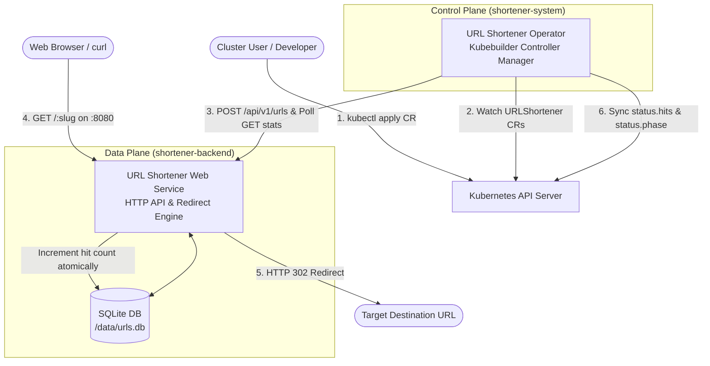

# Kubernetes URL Shortener Operator & CRD

An educational, production-pattern Kubernetes Operator and Custom Resource Definition (CRD) built with **Kubebuilder** and Go, designed for learning real-world cloud-native operator patterns.

This project decouples the **Control Plane** (the Operator managing Kubernetes resources) from the **Data Plane** (the high-performance HTTP service handling URL redirection and access tracking).

---

## 🏛 Architecture



---

## 🌟 Key Features

* **Custom Resource Definition (`shortener.tapsi.cloud/v1`):** Declare shortened URLs natively in Kubernetes YAML.
* **Separation of Concerns & Namespace Isolation:**
  * Operator runs in its dedicated `shortener-system` namespace.
  * Backend web service runs in its dedicated `shortener-backend` namespace.
  * Reconciles user resources in any namespace (e.g. `default`).
* **Atomic Hit Counting:** The SQLite data plane atomically increments hits upon each HTTP 302 redirect.
* **Periodic Telemetry Polling (`RequeueAfter`):** The operator continuously polls hit counts every 10 seconds.
* **etcd Write Optimization:** Status updates (`r.Status().Update()`) only execute when the hit count actually changes, avoiding etcd thrashing and infinite reconcile loops.
* **Kubernetes Finalizers (`shortener.tapsi.cloud/finalizer`):** Deleting a CR automatically sends a `DELETE` request to clean up the backend database before the CR is freed from the cluster.
* **Rich Terminal Tables (Printer Columns):** Inspect URLs, targets, hit counts, and phases directly via `kubectl get urlshorteners`.

---

## 📂 Repository Structure

```
kuber-crd/
├── backend/                  # Data Plane: URL Shortener HTTP service
│   ├── db/                   # SQLite storage layer with atomic counters
│   ├── server/               # REST API & HTTP 302 redirect engine
│   ├── deploy/               # Kubernetes Deployment, Service, and Ingress
│   ├── Dockerfile            # Multi-stage container build
│   └── main.go               # Server entrypoint
├── operator/                 # Control Plane: Kubebuilder Operator
│   ├── api/v1/               # Go struct definitions for URLShortener CRD
│   ├── cmd/main.go           # Operator manager entrypoint
│   ├── config/               # Kustomize manifests (crd, rbac, manager, samples)
│   ├── internal/client/      # Operator's HTTP client for the backend service
│   ├── internal/controller/  # Reconcile loop and finalizer logic
│   ├── Dockerfile            # Operator container build
│   └── Makefile              # Code generation and build targets
├── scripts/                  # Cluster bootstrap scripts
│   └── setup-cluster.sh      # Creates k3d cluster with port 8080 mapped
└── docs/                     # Design specs and implementation plans
```

---

## 🚀 Quick Demo

### 1. Apply a Sample Custom Resource
```bash
kubectl apply -f operator/config/samples/shortener_v1_urlshortener.yaml
```

### 2. View Status via `kubectl`
```bash
kubectl get urlshorteners -n default
```
Output:
```
NAME       TARGET                             SHORT URL                        HITS   PHASE   AGE
k8s-docs   https://kubernetes.io/docs/home/   http://localhost:8080/k8s-docs   0      Ready   5s
```

### 3. Visit the Short URL
```bash
curl -I http://localhost:8080/k8s-docs
```
Output:
```http
HTTP/1.1 302 Found
Location: https://kubernetes.io/docs/home/
```

### 4. Watch Hits Increment in Real-Time
Generate traffic:
```bash
for i in {1..5}; do curl -s http://localhost:8080/k8s-docs > /dev/null; done
```
Within 10 seconds, inspect the CR:
```bash
kubectl get urlshorteners -n default
```
Output:
```
NAME       TARGET                             SHORT URL                        HITS   PHASE   AGE
k8s-docs   https://kubernetes.io/docs/home/   http://localhost:8080/k8s-docs   6      Ready   45s
```

### 5. Clean Up via Finalizer
```bash
kubectl delete urlshortener k8s-docs -n default
```
The operator intercepts the deletion timestamp, calls `DELETE` on the backend service to delete the record from SQLite, removes the finalizer, and terminates the resource cleanly.

---

## 📖 Setup & Developer Guide

For complete instructions on setting up from scratch or making changes to the backend and operator, see [SETUP_AND_CONTRIBUTION.md](SETUP_AND_CONTRIBUTION.md).
